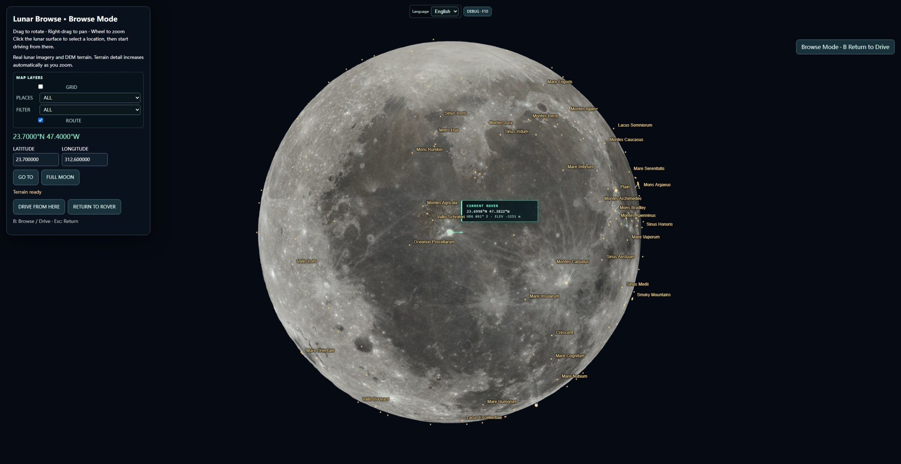
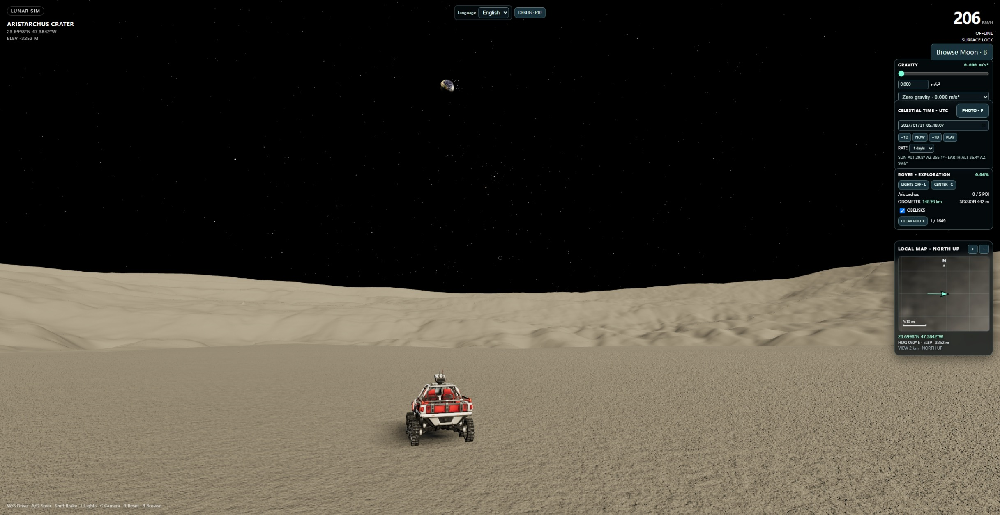

# Lunar Sim

A browser-based lunar simulator built with **Three.js, Vite, and Socket.IO**.

The project renders a real-scale Moon (`1 unit = 1 meter`) from lunar DEM data, supports global latitude/longitude driving with a floating origin, provides a Google-Earth-style lunar browser, reproduces the Sun/Earth/star sky by time, and adds exploration gameplay on top of official USGS/IAU lunar nomenclature.





## Highlights

- Real lunar reference radius: **1,737,400 m**
- Global terrain:
  - **SLDEM2015 512 ppd** for 60掳S鈥?0掳N
  - **NASA/GSFC LOLA adjusted polar DEM** for 60掳鈥?0掳 north and south
- Runtime quadtree LOD, packed DEM tiles, cross-LOD seam handling, and floating origin
- Progressive terrain loading: the landing area becomes drivable before the full far field is built
- Third-person rover with adjustable gravity, headlights, free camera, camera recenter, odometer, and route history
- Browse Mode with official USGS/IAU Moon place names and exploration filters
- 9,000+ adopted lunar nomenclature features in the bundled compact catalog
- Deterministic local exploration POIs, area completion, and unlockable obelisks
- Date/time-controlled Sun and Earth directions, Earth phase, NASA Earth textures/cloud layer, and a real bright-star catalog
- Socket.IO multiplayer state synchronization
- English, Simplified Chinese, Japanese, and Korean interface with a persisted language preference
- Optional Debug HUD for terrain-provider, block, LOD, cache, floating-origin, and rover diagnostics

## Important: terrain data is not stored in Git

The generated DEM folders are intentionally excluded:

```text
public/moon/global/blocks/
public/moon/global/polar/
```

They are built locally from the upstream scientific datasets.

The code repository stays small; each user can choose a maximum LOD appropriate for their disk and setup.

### Terrain data source: local development vs production

Lunar Sim keeps code and web terrain data separate. The runtime chooses the terrain base URL automatically:

- `npm run dev` uses the local path `public/moon/global` via `/moon/global`.
- Production builds use the public LOD0-LOD5 web dataset at `https://alexvirtualworld.github.io/Lunar-sim-data/moon/global`.
- Any deployment can override the terrain host with the Vite environment variable `VITE_LUNAR_DATA_BASE_URL`.

For example, to build against your own terrain host:

```bash
VITE_LUNAR_DATA_BASE_URL=https://example.com/moon/global npm run build
```

On Windows PowerShell:

```powershell
$env:VITE_LUNAR_DATA_BASE_URL='https://example.com/moon/global'
npm run build
```

To make a production build use terrain bundled under the same site, set:

```text
VITE_LUNAR_DATA_BASE_URL=/moon/global
```

The terrain host must expose the same directory structure expected by `GlobalHeightTileLoader`, including `index.json`, block/polar manifests, `ranges.bin`, and packed LOD files.

### Deployment base path

Local development always uses `/`, so `npm run dev` continues to run at the normal local Vite URL.

Production builds default to the GitHub Pages project path `/Lunar-sim/`. This makes the generated asset URLs work at:

```text
https://alexvirtualworld.github.io/Lunar-sim/
```

If you deploy Lunar Sim somewhere else, override the build base path with `VITE_BASE_PATH`.

Deploy at a domain root:

```bash
VITE_BASE_PATH=/ npm run build
```

Windows PowerShell:

```powershell
$env:VITE_BASE_PATH='/'
npm run build
```

Deploy under another subdirectory:

```bash
VITE_BASE_PATH=/my-app/ npm run build
```

Windows PowerShell:

```powershell
$env:VITE_BASE_PATH='/my-app/'
npm run build
```

`VITE_BASE_PATH` controls where the application assets are served from. `VITE_LUNAR_DATA_BASE_URL` independently controls where lunar DEM data is loaded from, so custom deployments can configure either or both.

Static runtime assets such as `rover.glb`, the browse-mode lunar albedo, Photo Mode preview imagery, Earth textures, the star catalog, and the lunar gazetteer are resolved through Vite's `BASE_URL`. This means they continue to work both at `/` and under a project subpath such as `/Lunar-sim/`.

### Multiplayer deployment

Local development keeps the existing behavior: `npm run dev` automatically connects Socket.IO to port `3000` on the same host.

A static production build (including GitHub Pages) does **not** attempt to connect to the page origin by default, because GitHub Pages cannot run the Node/Socket.IO server. The simulator therefore runs offline/single-player unless a multiplayer server is explicitly configured.

To enable multiplayer in a production deployment, set:

```text
VITE_SERVER_URL=https://your-socket-server.example.com
```

The configured server must run the project's Socket.IO backend and permit connections from the deployed frontend origin.

For GitHub Pages, deploy the generated `dist/` directory rather than serving the repository source root directly.

## Quick start

### Requirements

- Node.js 20+ recommended
- Python 3.10+
- A modern desktop browser with WebGL2
- Enough disk space for the LOD you choose

### 1. Install dependencies

```bash
npm install
python -m pip install -r tools/lunar-data/requirements.txt
```

### 2. Download/build lunar terrain

**Recommended: Use Pre-processed Data**
To save time, you can download the pre-processed LOD0-4 terrain data directly without running the build script.
1. Go to the [Releases page](https://github.com/alexVirtualWorld/Lunar-sim/releases/tag/data-v1) and download `blocks.zip` and `polar.zip` from the Assets section.
2. Extract the zip files.
3. Place the extracted files into the `public/moon/global/blocks` and `public/moon/global/polar` directories within your project, respectively.

**Alternative: Build from source**
If you prefer to download and build the data yourself, you can run the python script:
```bash
python tools/lunar-data/download_moon_data.py
```

This defaults to **LOD4** and builds:

```text
LOD0
LOD1
LOD2
LOD3
LOD4
```

In other words, `--lod 4` means **maximum LOD 4**, not 鈥淟OD4 only鈥?

Choose another maximum level:

```bash
python tools/lunar-data/download_moon_data.py --lod 6
```

Maximum detail:

```bash
python tools/lunar-data/download_moon_data.py --lod 8
```

The wrapper reuses the project's existing scientific build pipeline:

```text
SLDEM source download/build
  -> global block stitching
LOLA polar download/build
  -> 卤60掳 polar boundary stitching
  -> seam validation
```

### Approximate generated DEM size

Measured from the current complete dataset layout (global blocks + both polar providers):

| Max LOD | Approx. generated size |
|---:|---:|
| 0 | 0.4 MiB |
| 1 | 1.5 MiB |
| 2 | 5.8 MiB |
| 3 | 23.4 MiB |
| **4** | **93.6 MiB** |
| 5 | 374.4 MiB |
| 6 | 1.46 GiB |
| 7 | 5.85 GiB |
| 8 | 23.40 GiB |

These are measurements from this project's current packed format, not guaranteed download sizes from the upstream servers.

### Data builder options

Build both data families (default):

```bash
python tools/lunar-data/download_moon_data.py --lod 4 --part all
```

Build only the 60掳S鈥?0掳N SLDEM blocks:

```bash
python tools/lunar-data/download_moon_data.py --lod 4 --part global
```

Build only polar data after a global build already exists:

```bash
python tools/lunar-data/download_moon_data.py --lod 4 --part polar
```

Validate existing seam data without rebuilding:

```bash
python tools/lunar-data/download_moon_data.py --validate-only
```

Keep upstream JP2/TIF source caches:

```bash
python tools/lunar-data/download_moon_data.py --keep-cache
```

Show the commands without changing data:

```bash
python tools/lunar-data/download_moon_data.py --dry-run
```

### 3. Run

```bash
npm run dev
```

Development services:

```text
Vite / Three.js: http://localhost:5173
Socket.IO server: http://localhost:3000
```

Production build:

```bash
npm run build
```

## Controls

### Drive Mode

| Input | Action |
|---|---|
| W / S | Accelerate / brake / reverse |
| A / D | Steer |
| Shift | Handbrake |
| Mouse drag | Orbit third-person camera |
| L | Toggle headlights |
| C | Recenter camera |
| B | Open Browse Mode |
| P | Take photo |
| R | Reload/reset the current landing site |
| F10 | Toggle the Debug HUD |

The UI also provides configurable gravity from 0 to 274.8 m/s虏, with presets for the Moon, planets, and the Sun.

### Browse Mode

- Orbit/pan/zoom the Moon
- Click the lunar surface to choose a landing position
- Click a displayed official place name/point for USGS/IAU information
- Start driving from the selected coordinate
- Toggle map layers:
  - longitude/latitude grid
  - place names / points
  - exploration status filter
  - recorded route
- Enable the Debug HUD to show the 卤60掳 SLDEM/LOLA provider boundaries

Place filters:

```text
ALL
UNEXPLORED
IN PROGRESS
EXPLORED
```

## Terrain architecture

The rover's authoritative position is geographic:

```text
latitude
longitude
elevation
```

Nearby terrain is rendered in a local ENU-like frame:

```text
East / Up / North
```

A **Floating Origin** recenters the render frame while geographic coordinates remain unchanged. This avoids feeding Moon-scale absolute positions directly to Float32 GPU geometry.

Runtime terrain flow:

```text
lat/lon
  -> global DEM provider lookup
  -> block/polar tile selection
  -> distance-based LOD
  -> local terrain mesh
  -> floating-origin transform
  -> rover/camera
```

The global mid-latitude blocks use equirectangular SLDEM data. Polar providers remain in polar-stereographic space and are converted at runtime.

See [ARCHITECTURE.md](ARCHITECTURE.md) for more detail.

## Project layout

```text
src/
  astronomy/    Sun, Earth, stars, time-based sky
  browse/       global lunar Browse Mode
  exploration/  POIs, progress, route, obelisks
  geo/          lunar coordinates and floating origin
  materials/    lunar regolith rendering
  network/      Socket.IO multiplayer
  terrain/      DEM loading, LOD selection and meshes
  ui/           HUD and local minimap
  vehicle/      rover, visual rig and camera

server/
  index.mjs     multiplayer server

tools/lunar-data/
  download_moon_data.py      user-facing data setup
  build_global.py            SLDEM block builder
  stitch_global.py           SLDEM block seam stitching
  build_polar.py             LOLA polar builder
  stitch_polar_boundary.py   direct 卤60掳 boundary stitch
  requirements.txt
  test_*.mjs                 data/runtime regression tests

public/
  data/         astronomy + lunar nomenclature metadata
  models/       rover runtime model
  moon/
    albedo/     Browse Mode Moon imagery
    global/
      index.json
      blocks/   generated locally; not committed
      polar/    generated locally; not committed
  textures/     Earth surface/cloud textures
```

## Data and attribution

Scientific datasets and third-party assets are **not covered automatically by the MIT software license**.

See [DATA_SOURCES.md](DATA_SOURCES.md) for the sources currently used by the project, including:

- SLDEM2015
- NASA/GSFC LOLA polar DEM
- NASA CGI Moon Kit / LROC imagery
- USGS / IAU Gazetteer of Planetary Nomenclature
- NASA Blue Marble / MODIS Earth imagery
- HYG v4.1 star catalog

### Rover model

The runtime rover model is:

```text
public/models/rover.glb
```

This model was created by the project owner using **Hunyuan**. It is a project-created asset, not a model downloaded from an external asset marketplace or third-party model repository.

## Tests

Examples:

```bash
node tools/lunar-data/test_polar_runtime.mjs
node tools/lunar-data/test_polar_terrain_manager.mjs
node tools/lunar-data/test_polar_seam_v2.mjs
node tools/lunar-data/test_lod_edge_morph.mjs
node tools/lunar-data/test_exploration_system.mjs
node tools/lunar-data/test_browse_layers_filters.mjs
node tools/lunar-data/test_open_source_ui_i18n.mjs
```

Some terrain tests require the corresponding generated DEM data to exist.

## Contributing

See [CONTRIBUTING.md](CONTRIBUTING.md).

In particular, do not commit generated `blocks/`, `polar/`, source-cache files, or local build output.

## License

Project source code is released under the [MIT License](LICENSE).

That license applies to this repository's project code. It does **not** relicense NASA/USGS/IAU datasets, HYG data, imagery, or other third-party scientific/data assets. The included rover model is a project-created Hunyuan-generated asset; see [DATA_SOURCES.md](DATA_SOURCES.md) for provenance notes.

